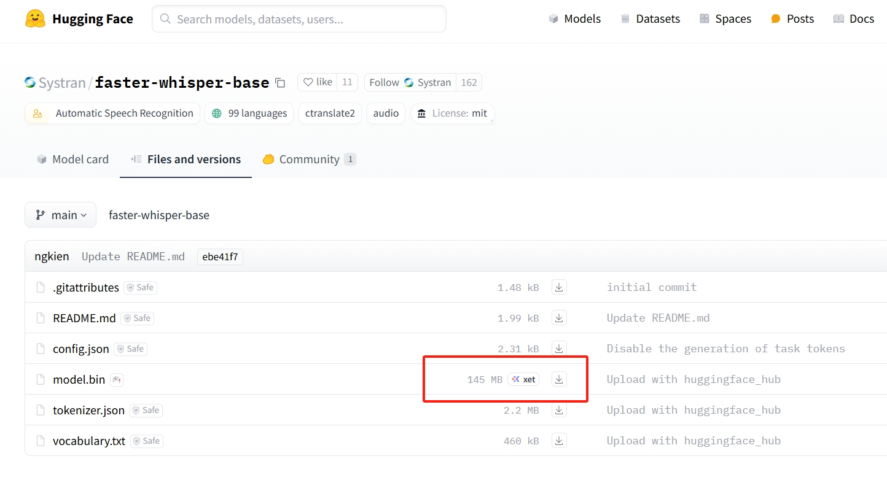
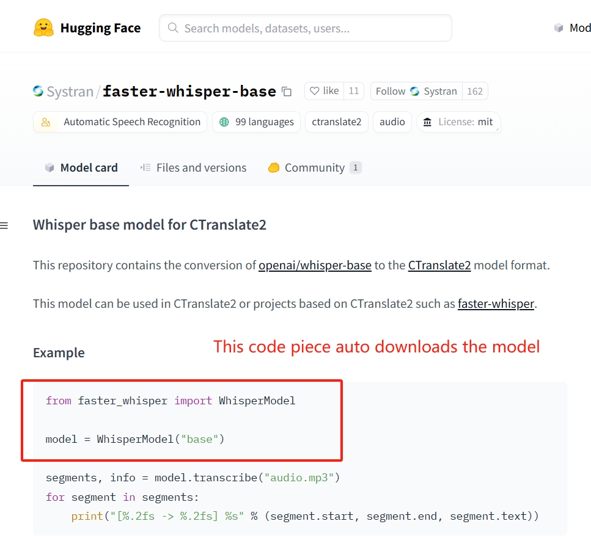

# Week 7: Part 2 - Speech Recognition

---------------
#### :dizzy: **Lab Date :** Feb 24, 26
#### :alarm_clock: **Due Date :** 2:00 pm March 3   
#### :pencil: Every group member must be present for every check point.
-------------------

## Task List
> [!CAUTION]
> Pi's Fan will run in full speed. Ensure no objects nearby the fan.

------------------
## 1. Configure Audio Devices

We have these two devices:

* Adafruit Mini USB Microphone: https://www.adafruit.com/product/3367
* Adafruit Mini USB Speaker: https://www.adafruit.com/product/3369


-----------------

- [ ] **First configure the speaker.**

Start with checking all audio output:

```shell
cao@raspberrypiCao:~ $ aplay -l
```

You should see ```USB Audio [USB Audio]``` in the list.

Your Audio output may de default set as the Minitor's HDMI. If so,

```shell
cao@raspberrypiCao:~ $ sudo raspi-config
```

Go to **1 System Options** , Then **S2 Audio** Then adjust settings.

Then run this testing Commond Line, or just play any YouTube video:

```shell
cao@raspberrypiCao:~ $ speaker-test -c2 -twav
```

------------------

- [ ] **Second configure the microphone.**

Start with checking all audio input:

```shell
cao@raspberrypiCao:~ $ arecord -l
```

You should see ```USB Audio [USB Audio]``` in the list. My terminal shows:

```shell
**** List of CAPTURE Hardware Devices ****
card 0: Device [USB PnP Sound Device], device 0: USB Audio [USB Audio]
  Subdevices: 1/1
  Subdevice #0: subdevice #0
```

From here, you need to know it is labeled as ```card 0``` and ```device 0```.

Then run this command line to record an audio file, here the 2 numbers in ```plughw:0,0 ``` responding to the previous ```card 0``` and ```device 0```

```shell
cao@raspberrypiCao:~ $ arecord -D plughw:0,0 -f cd test.wav
```

You can Ctrl+C to stop recording. Then listen to the audio in your folder.


## 2. Install and Use ```faster-whisper```

OpenAI developed Automatic Speech Recognition models called ```whisper``` :

https://platform.openai.com/docs/guides/speech-to-text

```faster-whisper``` is a GitHub project that re-implements OpenAI's ```whisper``` model and works faster:

https://github.com/SYSTRAN/faster-whisper 

- [ ] **pip3 install**

Do such in Terminal:

```shell
cao@raspberrypiCao:~ $ pip3 install faster-whisper --break-system-packages
```

This will install all required packages for ```faster-whisper```. After installation, our Terminal shows:

- [ ] **Download models**

The Speech Recognition models are not defaulty downloaded in your Pi.

You need to be aware which models are situable for your Pi.

In Python,

````python
```python
from faster_whisper import available_models

print(available_models())
```
````

These printed models, they are actually hosted on ```Huggingface``` website:

https://huggingface.co/Systran 

For each listed model, you can clicked into:

* In **Files and versions**, you can see their download size. Better avoid download something over 1 GB. It would be too much for your Pi.
  <kbd></kbd>
* In **Model card**, if you run the Python code piece in Example, it will automatically download the model to your Pi.
  <kbd></kbd>

------------  
- [ ] **Check models**

After downloading the models, use our USB microphone and record a 10 seconds audio.

Do such code. Check Comments:

```python
from faster_whisper import WhisperModel

model_size = "base"
model = WhisperModel(model_size, device="cpu", compute_type="int8")
# Always do this setting for Pi.

segments, info = model.transcribe("test.wav", language="en", beam_size=5)
# you can specify "en" (English) to many other languages
# to check the full list of supported languages.
# check HuggingFace models -> Files and versions -> README.md

for segment in segments:
    print("[%.2fs -> %.2fs] %s" % (segment.start, segment.end, segment.text))

```

🎉 **Check Point 3**


## 3. Airport Service Assitant

- [ ] **Consider such situation:**

At JFK International Airport, passengers speak many different languages, while most airport staff speak English. 

To bridge the language gap, you want to design a multilingual translation system that allows airport staff to understand passengers in other languages.

This today's lab, we are not going to realize the full system. We will just do the Speech Recognition part. You don't need to do the Language translation part. 

If you really want to realize the full system, you can use Google Cloud Translation in Python to do the translation part:  https://github.com/googleapis/google-cloud-python/tree/main/packages/google-cloud-translate 

- [ ] **So, here are the detailed design requirements:**
	- [ ] One student acts as the passenger speaking a non-English language. You can coordinate with other groups to get multiple non-English languages.
	- [ ] The system first lets passenger to select a language.
	- [ ]  The passenger starts and stops speech with simple GUI interaction.
	- [ ] The audio is processed by ```faster-whiper``` Speech Recognition. The non-English message then displayed on GUI.

Note: some non-Latin languages may need to install extra fonts. Then display using ```from PyQt5.QtGui import QFont``` .

Note: make your final GUI copy-able. So that lab staff can verify it with Google Translate.

🎉 **Check Point 4**


---
