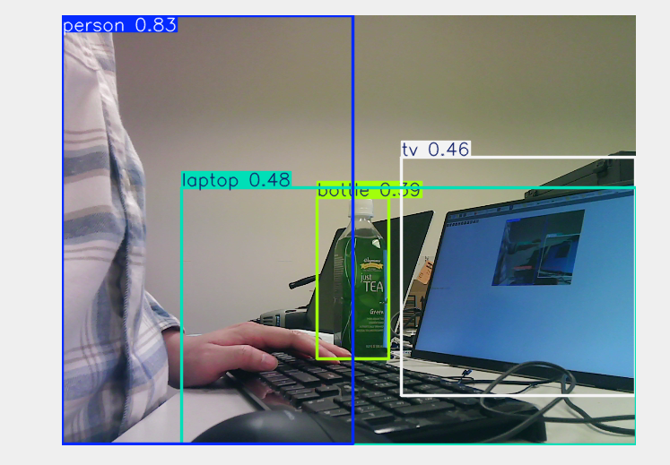
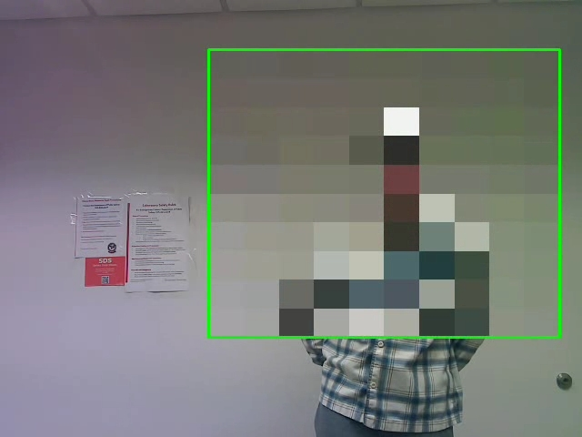

# Week 8: Computer Vision 1

---------------
#### :dizzy: **Lab Date :** March 3, 5
#### :alarm_clock: **Due Date :** 2:00 pm March 19   
#### :pencil: Every group member must be present for every check point.
-------------------

## Task List
> [!CAUTION]
> Pi's Fan will run in full speed. Ensure no objects nearby the fan.

------------------
## 1. Basic Set-up

- [ ] **Install Ultralytics**

> [!TIP]
> You need to do this earlier. The entire installation may take half an hour.
> 
<br>Go to https://github.com/ultralytics/ultralytics find the installation command.

Always remember to adjust for Pi OS: ```pip3``` and ```--break-system-packages```

```Ultralytics``` automatically installation many other necessary Python packages for computer vision. 

- [ ] **Connect a USB camera to USB 3.0**

- [ ] **Run YOLO**

In Python, run ```yolov8n``` PyTorch model. Use USB camera to capture in real time. Display the stream on your Pi.

  ```python
  model = YOLO("yolov8n.pt")
  ## n is nano model (smallest)
  ## .pt is the PyTorch format. 
  ## YOLO also has implementations in other frameworks beyond PyTorch.
  ```
  
> [!NOTE]
>In Pi OS, the  ```cv2.imshow``` often conflicts with system GUI and may result to an error ```could not find the Qt platform plugin "wayland"``` . If so, you can use Python ```flask``` package to display the stream on Pi's browser.
  
Here is my result:



You will notice the frame rate is very low. 
  
Play with different objects nearby.

🎉 **Check Point 1**

------------------
## 2. Old-Fashioned Computer Vision: Haar Cascades

In this task, we will play with an old-fashioned object detection method in computer vision -- **Haar Cascades**

This method, also known as **Viola–Jones Object Detection Framework**, was used as **the first** real-time face detector. https://en.wikipedia.org/wiki/Viola%E2%80%93Jones_object_detection_framework 

Haar Cascades method distinguishes an object based on grayscale brightness differences between itself and its surroundings. **Haar** refers to **Haar-like feature**.  https://en.wikipedia.org/wiki/Haar-like_feature

#### References

- Viola, Paul, and Michael Jones. ["Rapid object detection using a boosted cascade of simple features."](https://ieeexplore.ieee.org/document/990517) *CVPR*, 2001.
- Lienhart, Rainer, and Jochen Maydt. ["An extended set of Haar-like features for rapid object detection."](https://ieeexplore.ieee.org/document/1038171) *ICIP*, 2002.

------------

Your task is to design a **pixelator for human's upper body**. In detail, you will do:

- [ ] **Use Haar Cascades as detector**

This detection can be realized using OpenCV ```cv2.CascadeClassifier``` . 

For upper body detection, you can load a configuration file on https://github.com/opencv/opencv/blob/4.x/data/haarcascades/haarcascade_upperbody.xml  

This xml configures pre-defined Haar features, cascade structure, and threshold for upper body detection. 

- [ ] **Pixelate the upper body**

The Haar Cascade will give you a rectangle, covering the detected upper body. Then you can use OpenCV to pixelate this rectangle.

- [ ] **Real-Time Stream**

Show a real-time streaming in your Pi. Again, if ```cv2.imshow``` not working, use ```flask``` package instead and display the stream on Pi's browser.

- [ ] **Tuning for better result**

Such old-fashioned method is very sensitive to your camera placement, brightness, background, ... .

To get a good result, you need to trial and error: 
* adjust paramters in```.detectMultiScale()```
* adjust your camera, light, and background setting.

I tried for a while and got such result. I placed a recorded video in Blackboard.



🎉 **Check Point 2**


---
