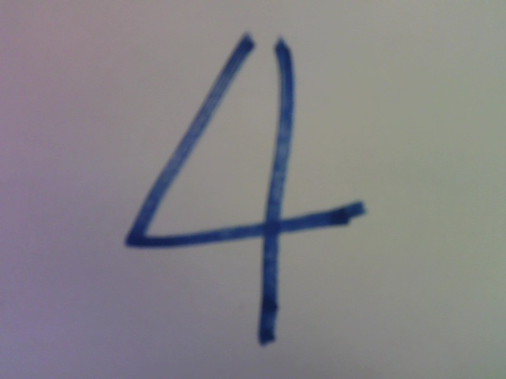
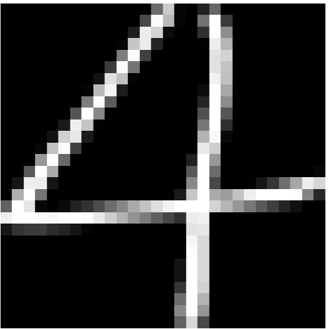
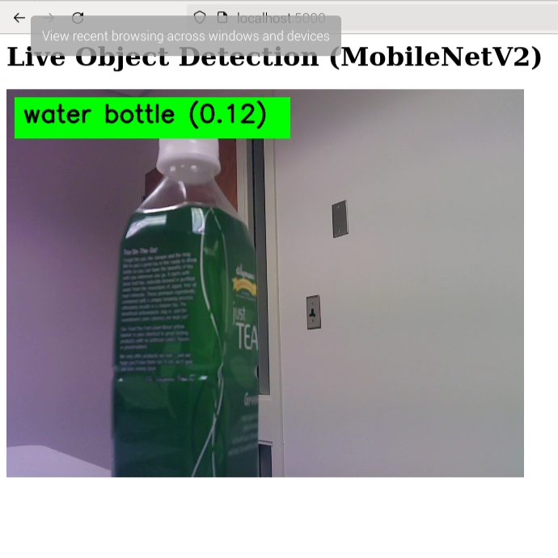
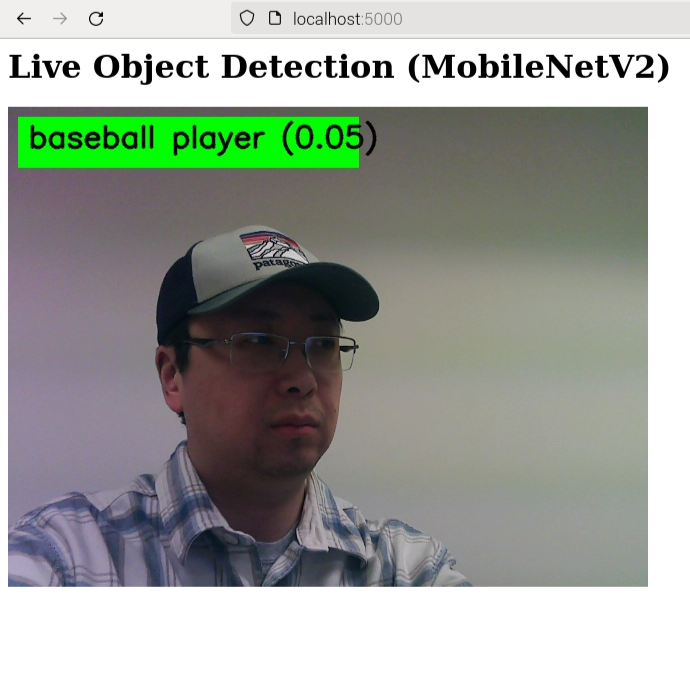

# Week 8: Computer Vision 2

---------------
#### :dizzy: **Lab Date :** March 3, 5
#### :alarm_clock: **Due Date :** 2:00 pm March 19   
#### :pencil: Every group member must be present for every check point.
-------------------

## Task List
> [!CAUTION]
> Pi's Fan will run in full speed. Ensure no objects nearby the fan.

------------------
## 3. Deep Vision Workflow

In this task, we will try the deep-learning-based computer vision. We will go thru the procedures step by step.

We will use **PyTorch** + **Torchvision** as deep vision framework. They are already installed when you installed ```Ultralytics``` 

We will try on a simple dataset -- **MNIST**.

----------------------

- [ ] **Prepare Training Data**

Use ```torchvision.datasets``` to download MNIST data to your local disk.

https://pytorch.org/vision/0.8/datasets.html#mnist

- [ ] **Check the Data**

Open your file folder to double check. You should have 4 compressed files:
*  training set images
* training set labels
* testing set images
* testing set labels

Start a new .py, use ```torchvision.datasets``` to load downloaded dataset. Then use ```matplotlib``` to display some images and their labels.

- [ ] **Train Neural Network**

Start over a new .py. Use ```torch.nn``` to create a neural network. Then train the neural network in the Pi.

* Remember to do ```torch.device("cpu")```, not ```gpu```
* Record your training time. expect to be >10 minutes.
* Save the trained model in your local disk.

- [ ] **Inference with Real Image**

* Use a Bold marker pen to write some digits on a white paper. (normal pen will be too thin in writing trace).

* Then, use Pi's USB camera to capture each digit in separate images. 

* Next, use OpenCV to preprocess images to convert them to the same style as MNIST images.

* Then, start over a new .py file. Use your previously trained neural networks and perform inference on the images.

* Does it predict the correct digit?

| **Pi's raw capture** |**After OpenCV process** |
|---------|---------|
|  |  |

```shell
>>> %Run processimagemnist.py
Predicted digit: 4
```

🎉 **Check Point 3**

------------------
## 4. MobileNet: Real-Time Object Detection

In the first task, when you run YOLO in Pi5, it runs slowly.

In this task, we introduce a faster method: **MobileNet** , this works well for embedded systems

You can access a **pretrained MobileNetV2 model in PyTorch**, https://pytorch.org/vision/main/models/generated/torchvision.models.mobilenet_v2.html

It is trained on **ImageNet-1K dataset**: https://en.wikipedia.org/wiki/ImageNet#ImageNet-1K 

Such pre-trained MobileNetV2 can predict 1000 different objects: 

* Standard naming: https://github.com/pytorch/hub/blob/master/imagenet_classes.txt ; 
* Alternative American-styled naming: https://github.com/anishathalye/imagenet-simple-labels 

#### References

- Sandler, Mark, et al. ["MobileNetV2: Inverted Residuals and Linear Bottlenecks."](https://arxiv.org/abs/1801.04381) *CVPR*, 2018.

-----------------------

Your task is to implement a **real-time object detector** in Pi. In detail:

- [ ] **Use Pre-trained MobileNetV2**

  It is in PyTorch: ```from torchvision.models import MobileNet_V2_Weights```

- [ ] **Stream**

  Use the Pi's USB camera. Stream the real-time video and prediction result in your Pi. Again, if ```cv2.imshow``` not working, use ```flask``` package instead and display the stream on Pi's browser.

- [ ] **FPS**

  Display the real-time frame rate (FPS).

----------
Here are 2 screenshots of my running (This is using ```flask``` package and display in a browser):

| **Screenshot 1** |**Screenshot 2** |
|---------|---------|
|  |  |

🎉 **Check Point 4**


---
