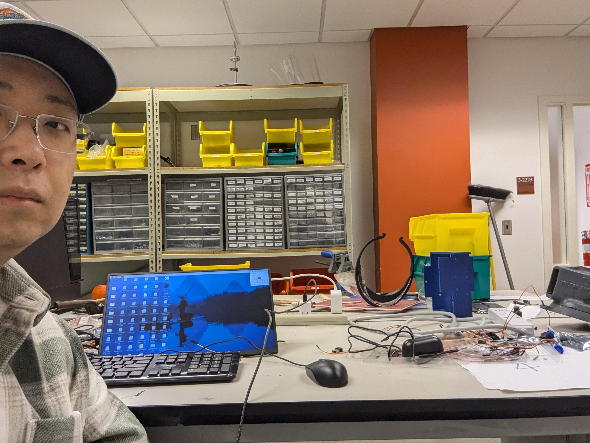
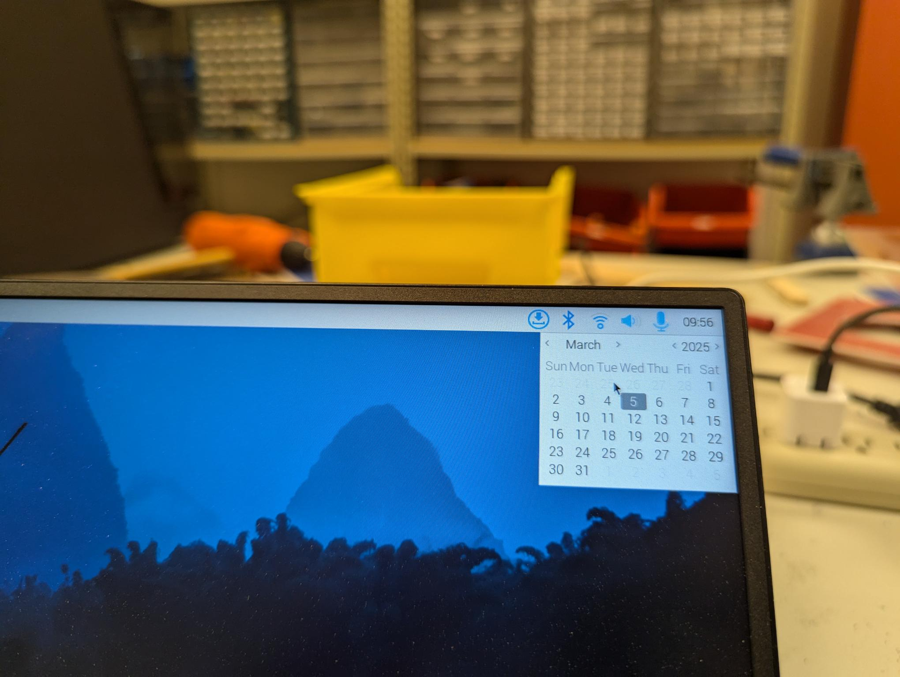
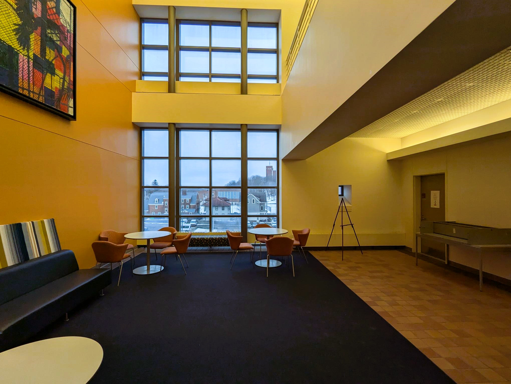

# CSE 398 Design Project

-------
**Lab staff: Yue Cao, Jiamin Zhao**

**Spring 2025, Syracuse University**

-------------

#### 1. Project Overview

The Design Project expects you to demonstrate your comprehensive skills on Computer Engineering. It is a prerequisite for the Senior Design. It can be a valuable highlight on your resume.

The Design Project starts right after the Spring Break. The Design Project ends at the last day of the class, **Monday, Apr. 28**.

----------

#### 2. Project Commitment

- [ ] Students should attend the regular lab session on Monday and Wednesday. If not, you need provide justified reason and make it up in other hours.

- [ ] Every Wednesday, students will have a 15 minutes group meeting with lab staff. The group meeting will review your last-week work and discuss next-week plan. Every group member needs to be present.

- [ ] Every student in a group is expected to complete **10 hours lab work** per week. 
	  Considering a group of 3 and 5 weeks, your project is expected to be 3 x 10 x 5 = **150 person-hours**.
	
- [ ] Every week, **every group** still need to maintain a **Markdown** to record your progress. The Markdown is still due every Monday evening.
	
- [ ] Every week, **every student** needs submit a **Work Timesheet** on their own, in word/pdf format.
	
	The Work Timesheet includes:

 	* All working hours, in-class and out-of-class. As well as brief statement of the work. 
	
	  >Cao worked on Feb 24 12:45-3:45pm, Feb 25 7-9 pm, Feb 26 1-5 pm. 
	  >* Feb 24 12:45-3:45pm (in class): I tried to use OpenCV to record video.
	  >* Feb 26 12:45-3:45pm (in class): I studied OpenCV documents on Haar Cascade. (It is counted that you just study some documents/watch other's walk thru video)
	  >* Feb 27 1-5 pm (out of class): I tried to implement Haar Cascade in Pi but failed. (It is counted that the trial failed, just say it)
  	
   	* Photo proof of all out-of-class hours.
	  
	  >* A set of Photo proof needs to contain: 1, one pic of your selfie with lab as background; 2, one pic of your raspberry pi time with lab as background.
	  >* Each set of Photo proof can mostly cover 3-hour period.
	  >* For example, if I work Feb 27 1-5 pm, I need two sets of Photo proofs: one set covering 1-4 pm, one set covering 4-5pm.
	  
| **selfie with lab background** |**pi time with lab background** |
|---------|---------|
|  |  |
----------

#### 3. Project Specifications

- [ ] Your project should be centered on Pi 5.
	
 	Your project **must** leverage the unique advantages of the **Raspberry Pi 5**.
	
	If your project can be implemented using **cheaper alternatives** such as an Arduino, **it is not valid**.
	
- [ ] Your project should be able to be demonstrated in a **small space** (2x2 meters)
	
	We  will use the **open space right outside the 3rd-floor elevator** for demo. This space is shared by 7 groups. 
	
	Also consider leave space for audience.
	
- [ ] Your project should include both hardware and software implementations.
	
	* For the **hardware**, you need to have at least **2 different types of peripherals**.

	    **These can be considered:** I2C-connected device, Serial-connected device, SPI-connected device, WiFi-communicated device, Bluetooth-communicated device, RF-communicated device, Motor, Camera, Microphone, Speaker, ...
   
	    **These are not counted:** LED, push button, buzzer, standard keyboard, mouse, standard Monitor, battery.
	
	* For the **software**, the implementation must demonstrate a **sufficient level of complexity and intelligence**.

	    Simple coding is not acceptable.
	
- [ ] Your project needs to adhere to Ethics guidelines
	
- [ ] Advice: Choose a topic that all team members are truly interested in.

----------

#### 4. Grade Breakdown

The design project take up 40% of the final grade.

It is distributed as:

* Proposal Presentation  **5 %**: group presentation
* Project Commitment **10%**:
   
  Determined by group meeting, group markdown, Work Timesheet. A student will lose 2% per week if not showing enough commitment. A student who didn't show enough commitment for all 5 weeks will receive 0 for this grading item.
* Final Report  **5%**: individual report
* Final Demo **20%**: will be judged by lab staff, other faculty, senior-design students.

-------------

#### 5. Project Agenda and Dues

- **Mar 17:** 
   no class attendance. group discussion on project proposal. any place you want
   **Mar 20:** 
   In-class: group meeting on project proposal.

- **Mar 24:** 
   In-class: group presentation on project proposal. 
   Evening due: project proposal slides on Blackboard, order request on Blackboard.
   **Mar 27:** 
   In-class: group meeting on project.

- **Mar 31:** 
   Evening due: group Markdown on Blackboard, individual Work Timesheet on Blackboard
   **Apr 2:** 
   In-class: group meeting on project.
  
- **Apr 7:** 
   Evening due: group Markdown on Blackboard, individual Work Timesheet on Blackboard
   **Apr 9:** 
   In-class: group meeting on project.
  
- **Apr 14:** 
   Evening due: group Markdown on Blackboard, individual Work Timesheet on Blackboard
   **Apr 16:** 
   In-class: group meeting on project.
  
- **Apr 21:** 
   Evening due: group Markdown on Blackboard, individual Work Timesheet on Blackboard
   **Apr 23:** 
   In-class: group meeting on project.
  
- **Apr 28:** 
   **Demo Day**

- **May 5:** 
   Evening due: individual report
  
-------------

#### 6. Order Request

Each group can request 100 USD purchase from the department. The order needs to be reviewed and approved. 

You can request purchase from the following vendors: 

* Amazon (1 week or more shipping time)
* Adafruit (2 weeks or more shipping time)
* SparkFun Electronics (2 weeks or more)
* DigiKey (2 weeks or more)
* Pololu Robotics and Electronics (2 weeks or more)
* https://www.robotshop.com/ (no clue)

